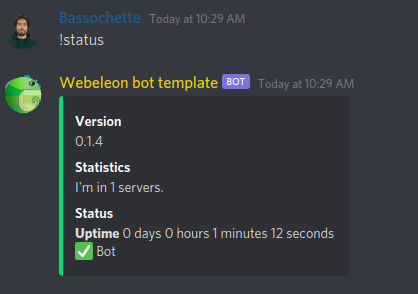

## Built in admin commands

The admin prefix is configured in the `ConfigService`. It can be overriden by the `ADMIN_PREFIX` environnement variable.

Those commands are bound to the administrator permission in the current server.

## `<admin prefix> set admin role`
Can only be used by server admins.

## `<admin prefix> set channel`

## `<admin prefix> unset channel`

## `<admin prefix> set prefix`

## Built in user commands

### `<prefix>help`


### `<prefix>invite`


### `<prefix>ping`


### `<prefix>status`



## Endpoints

- [GET] `/` `/health`
Health check, should always return OK

- [GET] /discord/bot-invite
helper method that redirect to the bot invite link

## Installation

```bash
$ npm ci
```

## Environnement variables

.env files supported

- PORT : default 5000
- DISCORD_API_TOKEN
- DISCORD_CLIENT_ID
- MONGO_URL
- ADMIN_PREFIX
- DEFAULT_PREFIX

## Running the app

```bash
# development
$ npm run start

# watch mode
$ npm run start:dev

# production mode
$ npm run start:prod
```

## Test

```bash
# unit tests
$ npm run test

# e2e tests
$ npm run test:e2e

# test coverage
$ npm run test:cov
```

## Built with

- [Nest](https://github.com/nestjs/nest) framework TypeScript.
- [discord.js](https://discord.js.org/#/) discord API client.
